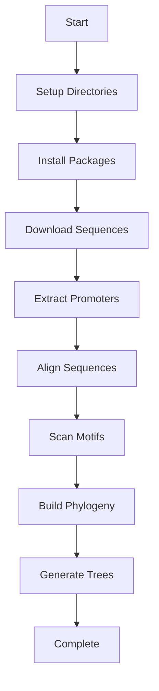

<div align="center">

# 🧬 AOS Phylogeny & Functional Analysis Pipeline

**Automated phylogenetic analysis and functional annotation of Allene Oxide Synthase genes**

[](https://www.r-project.org/)
[](https://opensource.org/licenses/MIT)
[](https://bioconductor.org/)

**Script:** `Final_Complete_Annotated.R` | **Author:** Victoria A. Dixon | **Date:** 2025-05-02

---

</div>

## 📋 Overview

This comprehensive R pipeline automates the retrieval and analysis of **Allene Oxide Synthase (AOS; CYP74A)** genes in *Solanum lycopersicum* (tomato). The pipeline integrates sequence retrieval, promoter analysis, motif scanning, and phylogenetic reconstruction into a single automated workflow.

### ✨ Key Features

- 🔍 **Automated Sequence Retrieval** - Downloads CDS and protein sequences from public databases
- 🧪 **Promoter Analysis** - Extracts and analyzes ~2kb upstream regulatory regions
- 🎯 **Motif Scanning** - Identifies functional domains and cis-regulatory elements
- 🌳 **Phylogenetic Trees** - Builds ML and NJ trees with bootstrap support
- 📊 **Publication-Ready Outputs** - Generates high-quality figures and alignments

---

## 🚀 Quick Start

```bash
# Clone the repository
git clone <repository-url>
cd Phylogenetic-Analysis-Script

# Run the pipeline
Rscript Final_Complete_Annotated.R
```

Or in R/RStudio:

```r
source("Final_Complete_Annotated.R")
```

> 💡 **Note:** The script automatically installs all required packages and creates necessary directories.

---

## 📦 Requirements

| Component | Version | Notes |
|-----------|---------|-------|
| **R** | ≥ 4.0 | Core programming environment |
| **Internet** | - | Required for sequence downloads |
| **FIMO** | Optional | For advanced motif scanning (MEME suite) |

### 📚 Package Dependencies

The pipeline automatically installs and manages all dependencies:

**CRAN Packages:**
- `biomartr` - Genome data retrieval
- `ape` & `phangorn` - Phylogenetic analysis
- `tidyverse` - Data manipulation
- `seqinr` - Sequence utilities

**Bioconductor Packages:**
- `rentrez` - NCBI database access
- `msa` - Multiple sequence alignment
- `Biostrings` - Sequence handling
- `ggtree` - Tree visualization
- `biomaRt`, `rtracklayer`, `IRanges` - Genome annotation

---

## 🔬 Pipeline Workflow



### 📝 Detailed Steps

#### 1️⃣ **Directory Setup**
Creates organized output structure:
- `data/` - Raw sequences, genomes, intermediate files
- `results/` - Alignments, trees, analysis outputs

#### 2️⃣ **Package Management**
- Automatically checks for and installs missing packages
- Handles both CRAN and Bioconductor dependencies
- Loads all required libraries

#### 3️⃣ **Sequence Retrieval** 🧬
- Downloads complete CDS and proteome for *S. lycopersicum*
- Filters sequences using pattern matching (`CYP74A|allene oxide synthase|AOS`)
- Saves filtered sequences:
  - `data/Sl_AOS_CDS.fasta`
  - `data/Sl_AOS_protein.fasta`

#### 4️⃣ **Promoter Extraction** 🧪
- Imports GFF3 annotation and genome FASTA
- Identifies AOS gene coordinates
- Extracts ~2kb upstream regions
- Handles strand orientation (reverse-complements negative strand)
- Output: `data/AOS_promoters_2kb.fasta`

#### 5️⃣ **Alignment & Motif Scanning** 🎯
- **Protein Alignment**: ClustalW multiple sequence alignment
  - Output: `results/AOS_protein_aln.fasta`
- **Heme-Binding Motif**: Scans for `F.GGPRC` pattern
- **Promoter Motifs**: FIMO scan for jasmonate-responsive elements
  - Output: `results/fimo_JA_elements/`

#### 6️⃣ **Phylogenetic Reconstruction** 🌳
- **Distance Calculation**: ML-based pairwise distances
- **Neighbor-Joining Tree**: Fast initial topology
- **Maximum Likelihood Optimization**:
  - Model: JTT (Jones-Taylor-Thornton)
  - Rate variation: Gamma distribution
  - Invariable sites: Estimated
- **Bootstrap Analysis**: 1000 replicates for node support
- **Visualization**: Publication-quality tree figures
  - `results/AOS_NJ_tree.png`
  - `results/AOS_ML_tree.png`

---

## 📂 Output Structure

```
Phylogenetic-Analysis-Script/
│
├── data/
│   ├── Sl_AOS_CDS.fasta              # Filtered coding sequences
│   ├── Sl_AOS_protein.fasta          # Filtered protein sequences
│   ├── AOS_promoters_2kb.fasta       # Promoter sequences
│   └── [genome and annotation files]
│
└── results/
    ├── AOS_protein_aln.fasta         # Multiple sequence alignment
    ├── AOS_NJ_tree.png               # Neighbor-Joining tree
    ├── AOS_ML_tree.png               # ML tree with bootstrap support
    └── fimo_JA_elements/             # Motif scan results
```

---

## 💡 Usage Tips

### 🔄 Re-running the Pipeline
To update with new data:
```bash
# Remove old outputs
rm -rf data/* results/*
# Re-run pipeline
Rscript Final_Complete_Annotated.R
```

### ⚙️ Customization
Edit script variables to modify:
- **Bootstrap replicates**: Change `bs = 1000` in `bootstrap.pml()`
- **Promoter length**: Modify `2000` in promoter extraction section
- **Substitution model**: Change `model = 'JTT'` to other models (WAG, LG, etc.)
- **Motif patterns**: Update `pattern_heme` or FIMO motif database

### 🖥️ Headless Execution
For non-interactive runs:
```bash
Rscript Final_Complete_Annotated.R > pipeline.log 2>&1
```

### 🐛 Troubleshooting
- **No sequences found**: Check pattern matching in sequence headers
- **FIMO errors**: Ensure MEME suite is installed and in PATH
- **Package installation fails**: Check internet connection and R version

---

## 🎨 Example Outputs

### Phylogenetic Tree
The pipeline generates publication-ready phylogenetic trees with:
- Bootstrap support values on nodes
- Clear tip labels
- Professional formatting

### Alignment
Multiple sequence alignment highlights:
- Conserved regions across AOS sequences
- Functional domains (e.g., heme-binding sites)
- Sequence variation patterns

---

## 🤝 Contributing

Contributions are welcome! Please feel free to:

1. 🍴 Fork the repository
2. 🌿 Create a feature branch (`git checkout -b feature/amazing-feature`)
3. 💾 Commit your changes (`git commit -m 'Add amazing feature'`)
4. 📤 Push to the branch (`git push origin feature/amazing-feature`)
5. 🔀 Open a Pull Request

For bug reports or feature requests, please open an issue on GitHub.

---

## 📄 License

This project is licensed under the **MIT License** - see the LICENSE file for details.

---

## 🙏 Acknowledgments

- **biomartr** and **Bioconductor** for sequence data access
- **phangorn** and **ape** for phylogenetic methods
- **ggtree** for beautiful tree visualizations

---

<div align="center">

**Made with ❤️ for phylogenetic analysis**

⭐ Star this repo if you find it useful!

</div>
